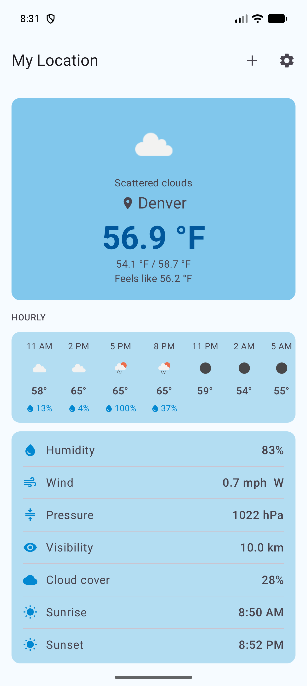
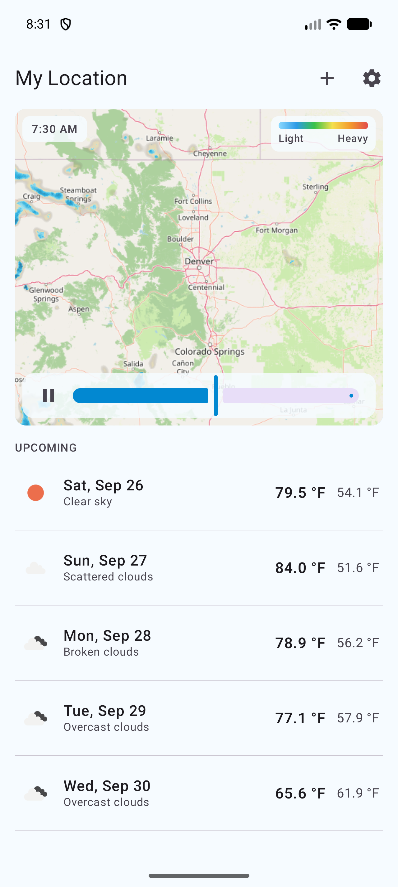
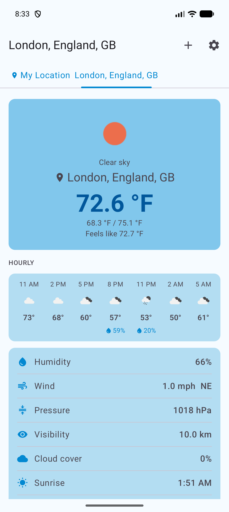
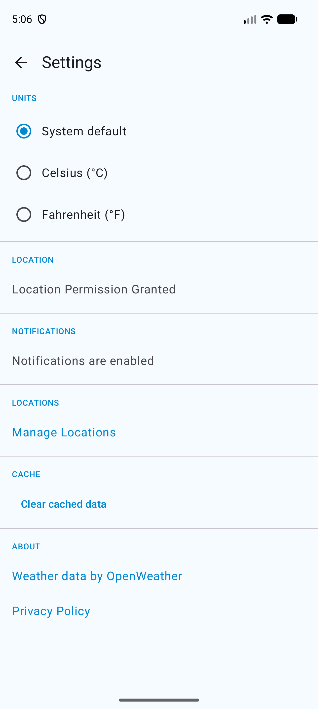

# Cats & Dogs


A clean, modern Android weather app. Track current conditions, an hourly and multi-day forecast,
and an animated precipitation radar for any number of saved cities, get daily push briefings, and
switch between metric and imperial units. Built with Jetpack Compose and Material 3.

There is also a native iOS version of the same product, built in Swift and SwiftUI:
[tuckercr/cats-dogs-iOS](https://github.com/tuckercr/cats-dogs-iOS).

Originally a coding-challenge project, the app has since been extended as a personal showcase of
Android best practices: clean architecture, unidirectional data flow, Hilt DI, background work with
WorkManager, and full CI/CD.

## Features

- **Current conditions** for any city: temperature, feels-like, daily min/max, humidity, wind
  speed & direction, pressure, visibility, cloud cover, and sunrise/sunset.
- **Hourly strip** with the next ~36 hours: time, condition icon, temperature, and rain chance.
- **Multi-day forecast** shown inline, aggregated to the city's local-timezone days with tappable
  day details.
- **Rain probability** surfaced per hour and per day.
- **Animated radar** — a RainViewer precipitation loop (recent past plus short-range nowcast) over
  an OpenStreetMap base, with a timeline scrubber, colour legend, and play/pause.
- **Multiple saved cities** with a swipeable, tabbed switcher.
- **Current location** resolved with one tap via fused location services.
- **Local time everywhere** — forecast days, hourly slots, sunrise/sunset, and the radar all render
  in the selected city's timezone.
- **Daily notifications** — weather briefings delivered on a schedule via WorkManager.
- **Unit selection** — System, Metric, or Imperial, chosen in Settings.
- **Offline-first** — per-city caching paints instantly, then refreshes silently in the background,
  with cached-data fallback and inline retry when the network fails.

## Screenshots

| Current & hourly | Animated radar | Multiple cities | Settings & units |
|---|---|---|---|
|  |  |  |  |

## Getting started

1. Create a free API key at [openweathermap.org](https://openweathermap.org/api).
2. Add it to `local.properties` (never committed to source control):
   ```
   OWM_API_KEY=your_key_here
   ```
3. Build and run. New keys may take up to 2 hours to activate.

The key is injected at build time into `BuildConfig.OWM_API_KEY`. On GitHub it is stored as an
Actions secret and injected automatically, so no key lives in the repository.

## Architecture & tech stack

| Layer | Choice | Notes |
|---|---|---|
| UI | Jetpack Compose + Material 3 | Single-Activity, screen-level composables, light/dark |
| State | `StateFlow` + `collectAsStateWithLifecycle` | Unidirectional data flow |
| DI | Hilt | Repositories and ViewModels are injected |
| Navigation | Compose Navigation | Type-safe destination constants |
| Background work | WorkManager | Periodic weather refresh + daily notifications |
| Networking | Retrofit + OkHttp + kotlinx.serialization | Suspend functions, no RxJava |
| Radar | RainViewer + OpenStreetMap tiles | Animated precipitation loop stitched on a Compose `Canvas`; frame speed via Remote Config |
| Images | Coil | Weather condition icons and radar/basemap tiles |
| Persistence | DataStore Preferences | Onboarding flags, saved cities, active city, unit override, per-city cache |
| Analytics | Firebase Analytics, Remote Config, Crashlytics | Optional; no-op without `google-services.json` |
| Modules | `:app`, `:weather-api` | API DTOs, parsing, and repositories split into `:weather-api` |
| Data sources | OpenWeatherMap `/weather` & `/forecast` + Geocoding; RainViewer radar frames | Free tiers; RainViewer needs no key |
| CI/CD | GitHub Actions | ktlint, JVM unit tests, and Compose UI tests (emulator) on every push |

## App flow

1. **Loading** — reads onboarding state from `DataStore` and routes to the right screen.
2. **Onboarding** — first launch walks through Welcome, notification permission, and location
   permission. Existing installs are migrated so they are never re-prompted.
3. **Current Weather** — shows the active city's conditions, an hourly strip, an animated
   precipitation radar, and the upcoming days inline. Swipe between saved cities, or add one by name
   with autocomplete from the [Geocoding API](https://openweathermap.org/api/geocoding-api) (a
   selected suggestion pins exact latitude/longitude so the result is unambiguous).
4. **Forecast** — uses `data/2.5/forecast` (free tier, 3-hour slots) with the same coordinates.
   Each calendar day shows the slot closest to local noon, plus the daily high/low and rain chance
   derived from all slots; tapping a day opens its full hourly breakdown.
5. **Radar** — RainViewer radar frames (recent past plus short-range nowcast) are stitched over an
   OpenStreetMap base and animated, with a scrubber and legend. All frame times display in the
   selected city's timezone.
6. **Settings** — choose temperature units (System / Metric / Imperial), manage saved locations,
   and open the privacy policy.
7. **Notifications** — WorkManager delivers daily weather briefings and refreshes cached data in
   the background; the schedule survives reboots.
8. **Error handling** — network failures, HTTP errors, empty API keys, and malformed payloads all
   surface as inline error messages with *Retry* where appropriate.

## Unit tests

| Test class | What it covers |
|---|---|
| `ForecastAggregatorTest` | Noon-slot selection and multi-day grouping |
| `OpenWeatherParsingTest` | Kotlinx Serialization round-trips for API DTOs |
| `WeatherRepositoryTest` | Repository contract: coordinate routing, city-query trimming, error mapping |
| `WeatherUnitsTest` | Locale-to-unit resolution (Android 13 and earlier fallback) |
| `WeatherForecastViewModelTest` | Cache-first loading, refresh races, and background-refresh staleness guards |
| `SettingsViewModelTest` | Unit-override selection and cache clearing |
| `WelcomeViewModelTest` | Onboarding state and persistence |
| `CityListViewModelTest` | Add, remove, reorder, and active-city tracking |
| `RadarRepositoryTest` | RainViewer timeline parsing, past/nowcast frame ordering, and tile URLs |
| `NotificationWorkerLogicTest` | Notification content and city-timezone "today" matching |
| `UpdateWorkerLogicTest` | Background refresh result routing, caching, and unit-override handling |

Compose UI tests live in `app/src/androidTest` (Welcome, onboarding, and the current-weather
screen states) and run on an emulator in CI via a separate `instrumented-tests` job.

## Temperature units

Users choose their preferred units in Settings: **System**, **Metric**, or **Imperial**. When set
to System, the app reads the Android 14+ temperature preference where available, and otherwise falls
back to a locale-based heuristic (US to Fahrenheit, otherwise Metric).
