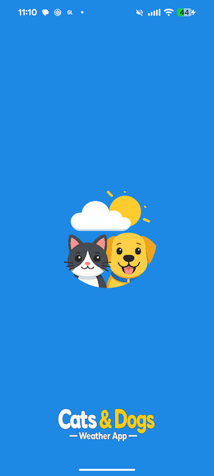

# Cats & Dogs

Simple weather client for a city: current conditions and a multi-day forecast, built for the recruiting exercise requirements.

## How to run

1. Create a free API key at [OpenWeatherMap](https://openweathermap.org/api).
2. Add the key to `local.properties`

   ```
   OWM_API_KEY=your_key_here
   ```
3. Build & Run.  Note that a new key can take up to 2 hours to become active.  If requested I can send one over.

The key is injected at build time into `BuildConfig.OWM_API_KEY` so it is not committed to source control.  In a production app this would be securely injected with CI/CD.

## Application flow

1. On launch a branded splash screen is displayed
2. The app reads `DataStore` preferences to check if the welcome screen was oreviously shown.
2. A welcome screen appears.  User advances by clicking the button or automatically after 5 seconds.
3. The user enters a city and clicks a button.  The UI shows conditions, OpenWeather icon (Coil), temperature, “feels like”, humidity and wind speed.
4. As a bonus I added **OpenWeatherMap Geocoding** suggestions. If the user picks a suggestion, **latitude/longitude** are sent so the result matches that place.
5. A successful response saves the location in `DataStore` so it is prefilled after an app restart.
5. Network failures, HTTP errors, empty API keys, and malformed payloads surface as an inline error message with **Retry** where appropriate.
4. From the current weather screen, the calendar icon opens the forecast screen. The app calls `data/2.5/forecast` using the same location as the last successful current fetch.
5. These are displayed as one row per calendar day, using the sample closest to local noon

## Framework, libraries, and API choices

- **UI** - Compose & Material 3
- **DI** - Hilt (Repositories and View Model are injected)
- **Navigation** - Compose Navigation was used
- **Async** - Coroutines with `viewModelScope` are used with Retrofit suspend calls
- **Networking** - Retrofit, OkHttp and Kotlinx Serialization
- **Image Download** - used a standard Coil `AsyncImage`
- **Data Storage** - used `DataStore` preferences to store the welcome flag and last resolved city name
- **API** - Used OpenWeatherMap.  Considered using Accuweather since I recently worked on a widget powered by Accuweather, but decided on a more open API as per the specs.

## Assumptions/Special Notes

- Forecast comes from the free 5-day endpointm, with the closest sample to noon chosen.
- On Android 14+ the temperature unit is based on user system settings, otherwise it falls back to basic geolocation based on the locale.  A real app would allow the user to choose.
- The welcome screen is marked seen when the user taps **Get started** or when the **5-second** auto-dismiss runs; a process kill mid-welcome may show it once more.

## Tests
- `ForecastAggregatorTest` - Forecast aggregation logic
- `OpenWeatherParsingTest` - Kotlinx Serialization parsing tests
- `WeatherUnitsTest` - Weather unit geolocation test (used on Android 13 and earlier)

## Demo Video
Note: this video is too large to view on GitHub so you'll need to download it as Raw)
[](./screen_recording/cats_and_dogs_demo_vid.mp4)
